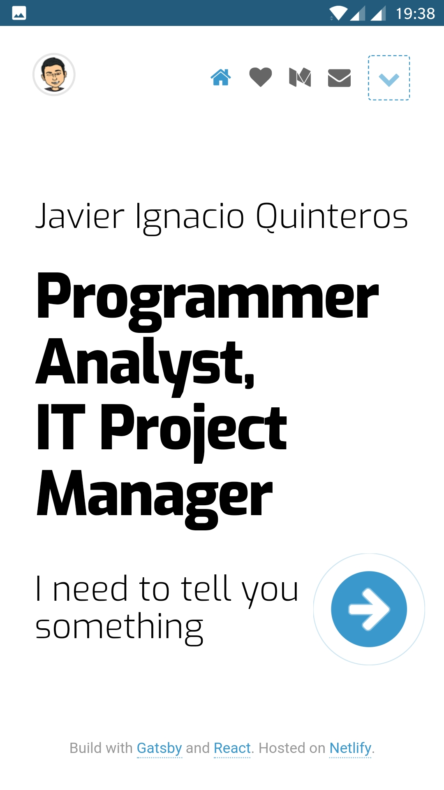
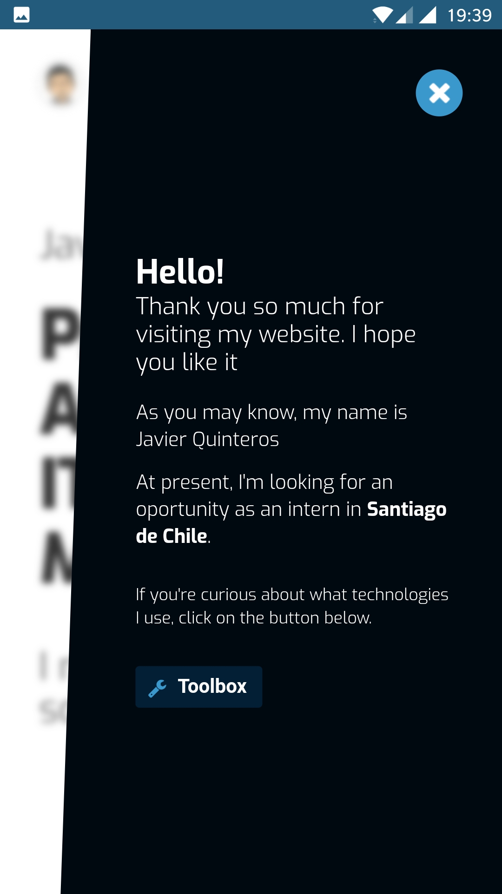
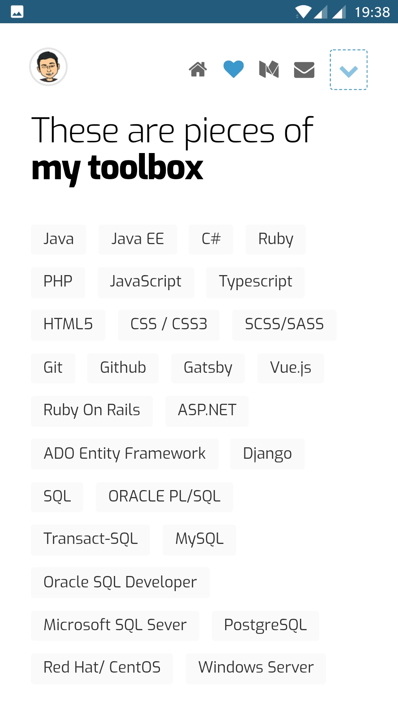
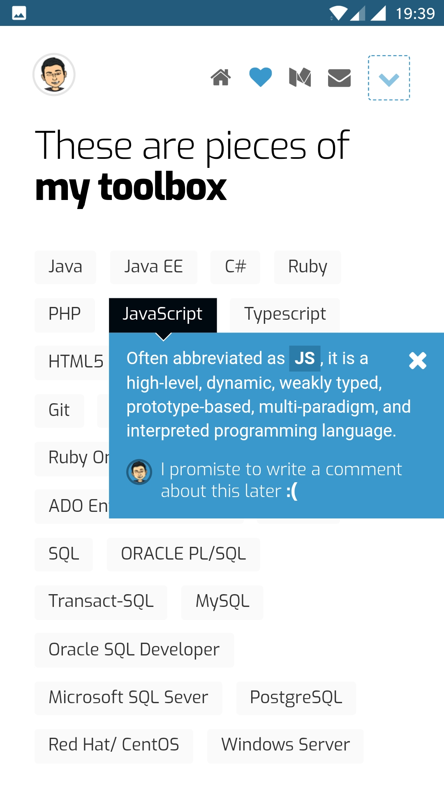
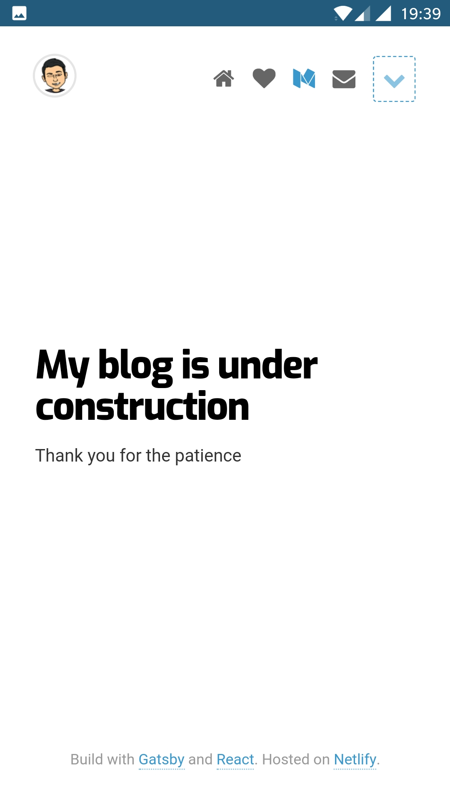
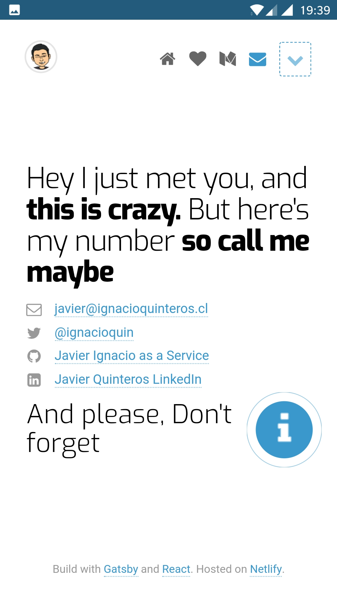
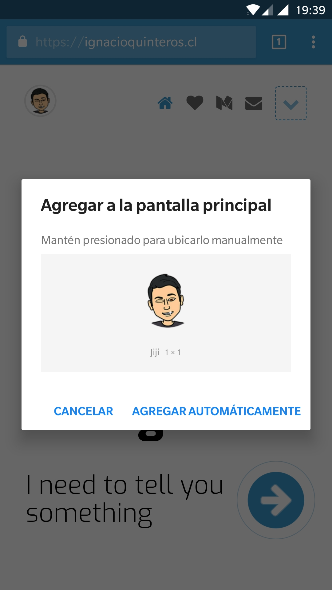

# Javier as a Service - www.ignacioquinteros.cl

This is the code of my website (ignacioquinteros.cl). All thanks to @greglobinski who started this open source project.

## Screenshots

### Build with

* [Gatsby](https://github.com/gatsbyjs/gatsby)
* [React](https://github.com/facebook/react)

### Starting point

* [Gregor Lobinski Project](https://github.com/greglobinski/www.greglobinski.com)

